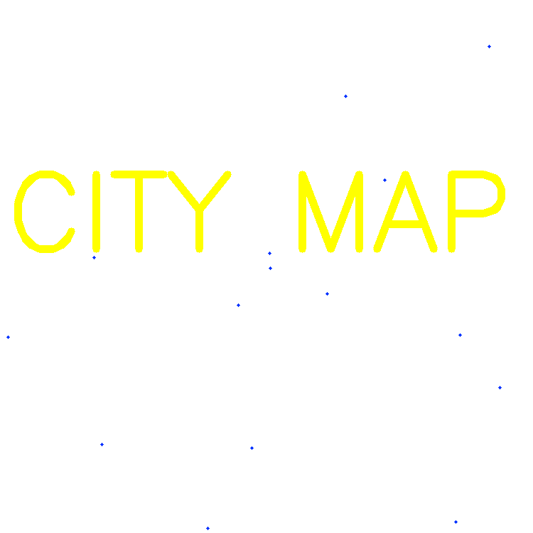
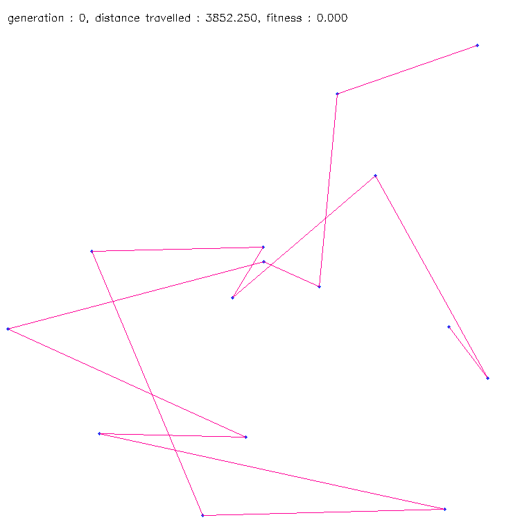
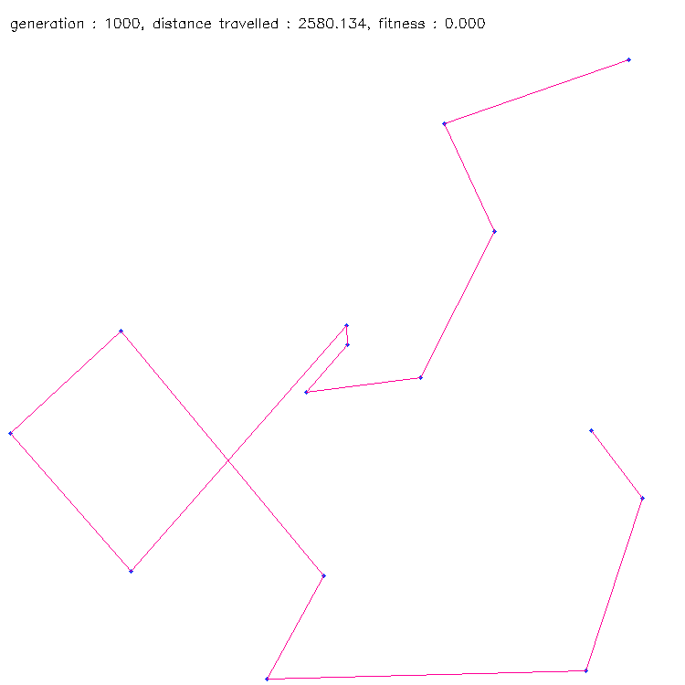
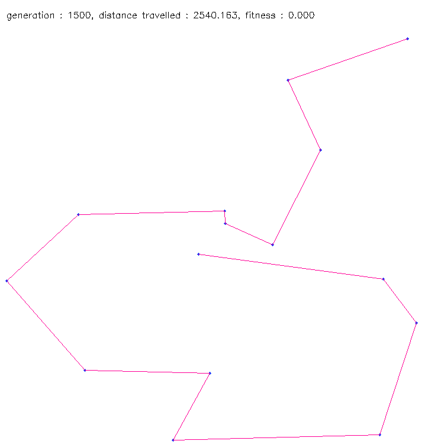
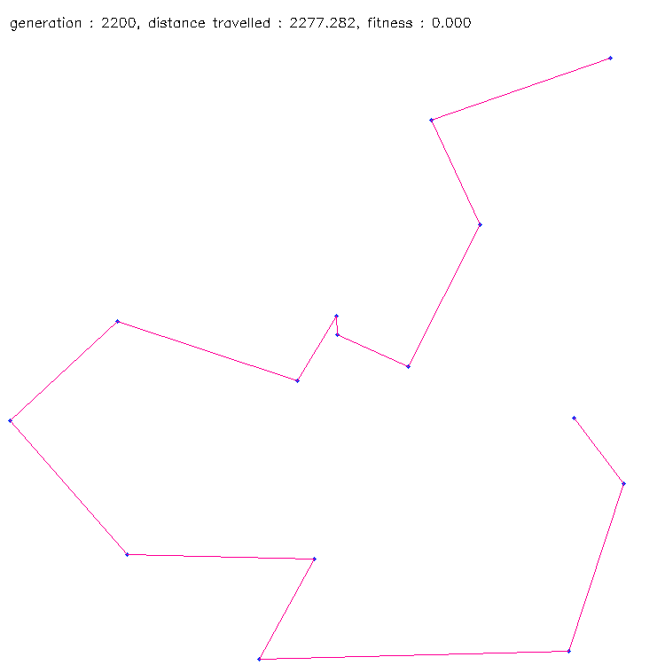

# genetic-algorithm
Genetic algorithm is a optimization algorithm inspired by natural selection, the process that drives biological evolution .

## Installation
clone this repository and execute the following commands:
   ##### to install requirements:
          pip install -r requirements.txt 
   ##### to try the codes:
   ######        1.sentence_generator
          python sentence_generator.py
   ######        2.TSP - travelling salesperson
          python TSP.py
                 
   to stop the code press 'esc' twice.
   
   to save the states press 'y' (states will be stored in ./output directory).
   
## Screen-shots

 

